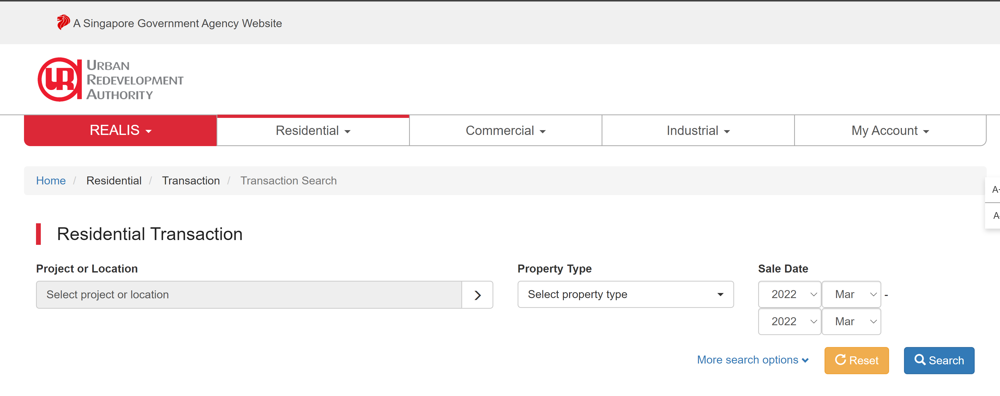
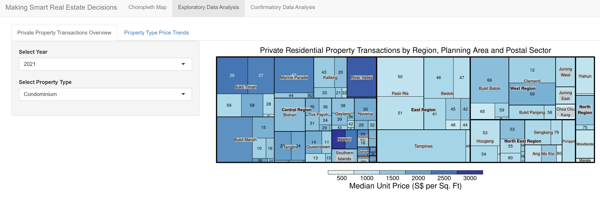
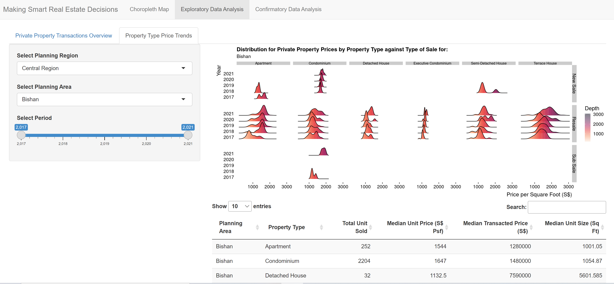
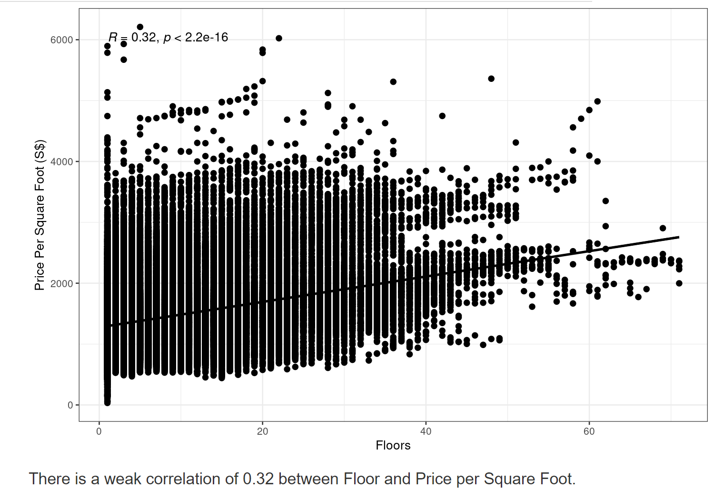

__Project REALVIS: Making Smart Real Estate Decision using Visual Analytics__

Visit our Shiny Application Page: [REALVIS](https://hengguang.shinyapps.io/REALVIS/)


# Project Introduction

Real estate is an industry where information is critical to make the right decisions for customers. Timely information can help potential buyers decide where and what they should invest time and resources to look into and reduce time wasted and effort spent.

In Singapore, information for real estate transactions is openly available on government websites for the public to download and use. Our team members were introduced to these data sets through various analytics classes where we used them to do various types of analysis.

However, for most members of the public, the raw data sets that are provided are as good as none since they lack in training regarding data analytics and visualization, without which it is nearly impossible to identify trends or items of interest from within the data set. Our project application provides users with visualizations that help them to breakdown and understand the data that is provided easily.

# Motivation

There are applications that perform visualizations and analysis similar or more complicated than ours out there in the market. Unfortunately, these applications are often targeted towards property agents with a substantial annual fee that make them unattractive and inaccessible to others. For non-agents to access them, they will need to contact a property agent who can help them with accessing the reports and visualizations.

This usually occurs when a client engages the property agent to help them source for suitable houses with a commission fee. Thus non-buyers or those unwilling to engage an agent will need to look elsewhere and this is where we come in.

# Our Application

The Shiny app we created using R consists of 3 modules.

1) Chloropleth Map, AKA  a Heat Map of Singapore
2) A Tree Map and Ridge Plot (Joyplot) to identify distribution patterns
3) Statistical Test Results

The first two modules will be suitable for most people without background knowledge of statistics to understand and use. The third module is more for us and others to test and confirm some common perceptions regarding the real estate industry.

## Data Source

For this project, we have only used data sets for Private Property Transactions obtained from the URA REALIS database [here](https://www.ura.gov.sg/reis/index).

```{r, echo = FALSE, fig.align = 'center', out.width = '100%', results = 'markup',fig.cap='REALIS database by URA'} 
  
```

Specifically, we used the data sets for residential transactions from Jan 2017 to Dec 2021 as we wanted to focus the application towards residental home-buyers.

## The Modules

### Chloropleth Map

```{r, echo = FALSE, fig.align = 'center', out.width = '100%', results = 'markup',fig.cap='Chloropleth Map of Singapore by Number of Transaction'} 
knitr::include_graphics("writeup/img/chloropleth.png")  
```

Our chloropleth map is designed to show the distribution of various types of values across the various planning areas of Singapore. Users will be able to determine the value that they are want to see as well as filter for specific types of property, types of sale and the year. With this, they will be able to see how the distribution changes with various input changes.

For example, if we were to compare the number of condominium sales between 2020 and 2021, we would be able to see that Geylang and Clementi had a visible increase in transactions whereas the western water cachement planning area saw fewer transactions.

### Tree Map

Our Tree Map allows users to compare the median price per square foot (psf) and number of transactions for private properties across the planning areas and postal sectors of Singapore at the same time. The size of each rectangle is determined by the number of transactions happening whilst the depth of the color represents the median price psf of that postal sector.

```{r, echo = FALSE, fig.align = 'center', out.width = '100%', results = 'markup',fig.cap='Tree Map of Condominium Transactions in 2021'} 
  
```

In the figure above, we can see that in 2021, the median prices for condominiums were overall higher in the central region and it had the most transactions compared to the other regions.

### Ridge Plot (Joy Plot)

The ridge plot was designed to follow up on the tree map where users will be able to select the areas of interest to them, for example, Bishan as in the figure below and observe the Price PSF trends by property type against type of sales.

```{r, echo = FALSE, fig.align = 'center', out.width = '100%', results = 'markup',fig.cap='Ridge Plot and Datatable for Bishan between 2017 to 2021'} 
  
```

They will be able to compare the distributions across the years as well, like how the price psf for resale apartments in Bishan consolidated towards the upper $1000s from 2017 to 2021.

There is also a supporting data table below that shows the median price psf, median transacted price, median size and number of units sold for each property type in the selected area within the specific year range.

### Statistical Test Results

We conducted 3 tests with our data sets to find out the following:

1) Whether there was a difference in price between Landed and Non-Landed properties.

2) Whether there was a different in price between freehold and tenured properties.

3) Whether there was a correlation between the floor number and property prices.

You can see the results for the last test below where we find that there was a weak correlation between floor and price.

```{r, echo = FALSE, fig.align = 'center', out.width = '100%', results = 'markup',fig.cap='Correlation Test between Floor and Price'} 
  
```

Hence, we can conclude that the floor of each property does affect the unit price. For the result of the other tests, visit our application!

# Conclusion

Our shiny application is currently only a working prototype that provides some visualization and analysis for users. However, we hope that with further improvements, our application will be of use to people who are searching for properties or interested in the private property market of Singapore.

Visit our shiny application [here](https://hengguang.shinyapps.io/REALVIS/) to try out the app and play around with the functions!

Thank you very much for visiting our site!

